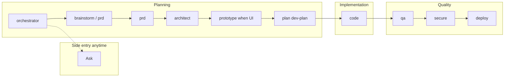
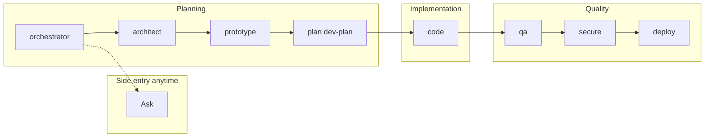
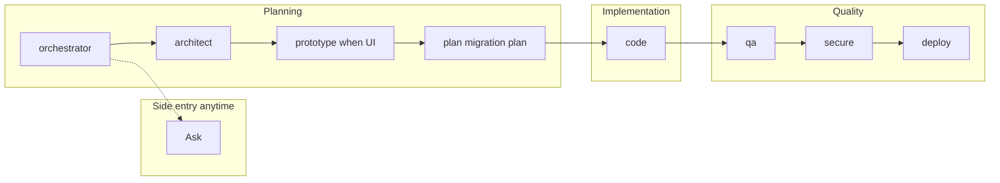
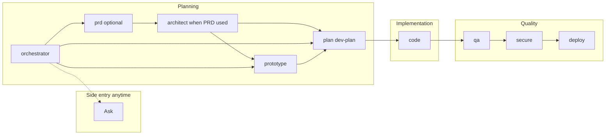
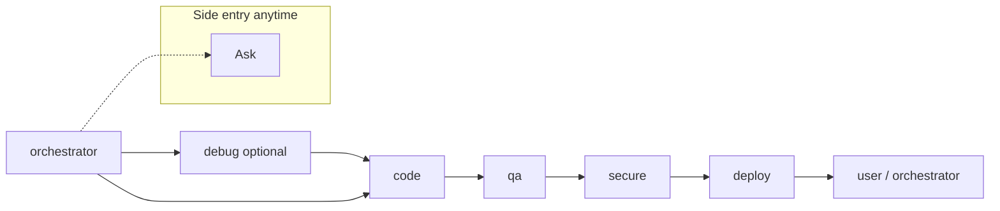
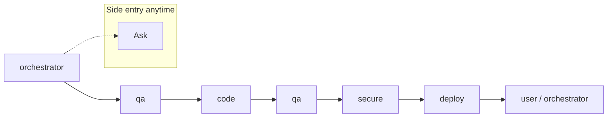

# Brownfield Use Cases: Diagrams and Explanations

This document defines diagram requirements and detailed explanations for each brownfield scenario. Use it to ensure pre/post architecture diagrams, flow diagrams, and explanations are produced where applicable.

---

## Overview: Diagram Requirements by Brownfield Type

| Brownfield                                 | Pre-Architecture             | Post-Architecture      | Flow Diagrams                 | Detailed Explanation |
| ------------------------------------------ | ---------------------------- | ---------------------- | ----------------------------- | -------------------- |
| **A** Extend product                       | Required                     | Required               | Required                      | Required             |
| **Migrate** Product migration (legacy→new) | Required (current/legacy)    | Required (target)      | Required (migration, cutover) | Required             |
| **B** Add feature (arch exists)            | Reference existing           | N/A (no arch change)   | Required for new flows        | Required             |
| **C** Fix bug                              | Optional (if scope warrants) | Optional               | Required if multi-step fix    | Required             |
| **D** Refactor                             | Optional (before state)      | Optional (after state) | Required for refactor scope   | Required             |

---

## Brownfield A: Extend Existing Product

**Trigger:** Add significant feature or module to existing product. Architecture may need review or extension.

**Entry:** orchestrator → architect (skips prd)

**Flow:** architect → prototype (when UI) → plan (dev-plan) → code → qa → secure → deploy

### Diagram Requirements

1. **Pre-Architecture Diagram (Current State)**

    - C4 Context or Container diagram showing the system **before** the extension
    - Include: existing modules, external systems, key integration points
    - Purpose: Baseline for stakeholders; shows what exists today

2. **Post-Architecture Diagram (Extended State)**

    - C4 Context or Container diagram showing the system **after** the extension
    - Include: new/modified modules, new integration points, schema/API changes
    - Purpose: Target state; shows what the extension achieves

3. **Impacted Integrations (subsection, immediately after post diagram)**

    - Which existing integrations are affected by the change
    - Impact chain: change → affected modules → APIs → flows
    - Downstream consumers (internal and external)

4. **Flow Diagrams**
    - Sequence or flowchart for each **new or significantly changed** user flow
    - Include: actors, systems, steps, decision points
    - Purpose: Clarify how the extension changes behavior end-to-end

### Detailed Explanation Requirements

- **Analyze existing architecture:** Read existing architecture.md and codebase. **Align** to existing when the request fits (extend without structural changes). **Propose changes** when the request requires modifications (new module, schema restructuring, etc.) — document what changes, why, impact.
- **Scope of Change:** What is being added or extended; why it matters
- **Integration Points:** How new work connects to existing modules, APIs, data
- **Impacted Integrations:** Which existing integrations are affected; impact chain (change → affected modules → APIs → flows)
- **Migration Path:** Data migration, API version migration, feature rollout/deprecation, product migration. See `.nayan/guidance/brownfield-migration-use-cases.md`
- **Traceability:** Map condensed scope / feature spec to new/modified modules and APIs

**Reference:** `.nayan/guidance/architecture-brownfield-structure.md`, `.nayan/guidance/brownfield-migration-use-cases.md`

---

## Brownfield Migrate: Product Migration (Legacy to New)

**Trigger:** Migrating from legacy system to new system; replacing entire product or major subsystem.

**Entry:** orchestrator → architect (skips prd). **Architect then prototype (when UI) before plan** — both required before migration planning.

**Flow:** architect → prototype (when UI; migration UX) → plan (migration plan) → code → qa → secure → deploy

### Diagram Requirements

1. **Pre-Architecture Diagram (Current / Legacy State)** — Required. C4 or equivalent showing legacy system, integrations, data sources.
2. **Post-Architecture Diagram (Target State)** — Required. C4 showing target system after migration; migration path.
3. **Impacted Integrations** — Required. Which systems/consumers are affected; migration timeline.
4. **Flow Diagrams** — Required. Migration flows, cutover, dual-run if applicable.

### Detailed Explanation Requirements

- **Migration strategy:** Big-bang vs phased vs parallel run; data migration (schema mapping, ETL, validation); cutover plan; dual-run period; verification. See `.nayan/guidance/brownfield-migration-use-cases.md`.

**Reference:** `.nayan/guidance/architecture-brownfield-structure.md`, `.nayan/guidance/brownfield-migration-use-cases.md`, `.nayan/rules-orchestrator/2_workflows_brownfield.xml` (brownfield-migrate).

---

## Brownfield B: Add or Enhance Feature (Architecture Exists)

**Trigger:** Architecture already exists. New feature or enhance existing feature; implementation may need a dev plan.

**When to include PRD:** Use PRD when the feature is substantial, an enhancement (new capability), or requires formal requirements or stakeholder sign-off — including when user provides **JIRA ID**, **SOW**, or **PRD** for add/enhance. **When user provides JIRA or SOW (instead of a full PRD):** Entry is **brainstorm first** — orchestrator → brainstorm (deeply understand JIRA/SOW requirements with user via Q&A/brainstorm) → prd → architect (architecture impact) → prototype (when UI) or plan (when API-only). When user provides a full PRD: orchestrator → prd → architect → prototype/plan. **Add/enhance with PRD always uses architect.** When the feature is small or the spec is already clear and no JIRA/SOW/PRD, skip prd: orchestrator → prototype (when UI) or plan (when API-only).

**Explicit UI change:** When the user or scope **explicitly requests a change in UI** (redesign, new look-and-feel, new design system, component/layout changes), use **prototype (create/update) → plan (create/update) first** in both greenfield and brownfield; **use architect (create/update)** only when there is API or architecture impact (new/changed APIs, backend, data model, new modules or integration points). Do not implement UI changes in code without this sequence. See `.nayan/guidance/pipeline-entry-points.md` (Explicit UI change requests).

**Entry:** orchestrator → prd (optional) | brainstorm (optional) | architect (when PRD was used) | prototype (when UI) or plan (when API-only). Architect runs only when PRD was used; architect produces architecture impact per architecture-impact-add-feature.md.

**Flow:** When PRD used: prd → architect → prototype (when UI) or plan → plan (dev-plan) → code → qa → secure → deploy. When PRD skipped: prototype (when UI) or plan → plan (dev-plan) → code → qa → secure → deploy

### Diagram Requirements

1. **Pre-Architecture Diagram**

    - **Reference existing** architecture.md; do not recreate
    - Development plan Section 1.1 summarizes existing architecture (tech stack, modules, patterns)
    - No new architecture diagrams—architecture does not change

2. **Post-Architecture Diagram**

    - **N/A** — architecture is unchanged; only implementation is added

3. **Flow Diagrams**
    - **Required:** Flow diagrams for each **new** user flow or feature path
    - Include: sequence or flowchart for the new feature; integration with existing modules
    - Purpose: Show how the new feature fits into the existing system

### Detailed Explanation Requirements

- **Context & Existing Assets:** Tech stack (from architecture.md), modules, key patterns
- **Existing Folder Structure:** **MANDATORY** — Analyze current codebase; document existing folder structure. Derive folder structure changes from existing vs. desired.
- **Scope of Change:** What is being added; how it fits existing design
- **Integration Points:** How the new feature connects to existing modules, APIs, data
- **Impacted Integrations:** Which existing integrations are affected by this feature
- **Product/Feature Migration** (when applicable): API version, rollout, deprecation. See `.nayan/guidance/brownfield-migration-use-cases.md`
- **Folder Structure Changes:** New/changed directories only; derived from existing structure analysis; aligned to existing conventions

**Reference:** `.nayan/guidance/architecture-impact-add-feature.md`, `.nayan/guidance/development-plan-brownfield-template.md`, `.nayan/guidance/brownfield-migration-use-cases.md`

---

## Brownfield C: Fix Bug

**Trigger:** Fixing a reported bug. Planning phases skipped; quality and security gates never bypassed.

**Bug vs enhancement:** If the "bug" is actually an enhancement (new capability, requirement change, or behavior change beyond original spec), do NOT use fix-bug. Classify as **brownfield-add-feature** or **brownfield-extend** and consider PRD so requirements are documented before implementation. True bug = restore or correct behavior to match existing spec.

**Phase distinction:** **Debug** = debug phase (diagnosis only; produces fix instructions and hands off to code). **Code** = code implementation phase (implements fix from debug handoff, or diagnoses and fixes in one flow with systematic-debugging).

**Entry:** orchestrator → **debug** (when "diagnose only, then hand off fix to Code" is desired) or **code** (when diagnose and fix in one flow).

**Flow:** When debug entry: debug → code → qa → secure → (deploy?). When code entry: code (diagnoses, HITL confirm diagnosis, applies fix) → qa → secure → (deploy?). After secure: orchestrator asks "Does this require deployment?" — if no, end; if yes, deploy.

### Diagram Requirements

1. **Pre-Architecture / Pre-Flow**

    - **Optional:** Use when the bug spans multiple components or flows
    - If used: diagram showing current (buggy) flow or component interaction

2. **Post-Architecture / Post-Flow**

    - **Optional:** Use when the fix changes component interaction
    - If used: diagram showing corrected flow after fix

3. **Flow Diagrams**
    - **Required when fix is multi-step or cross-component:** Sequence or flowchart for bug path and fix path
    - **Optional for simple one-line fixes:** No flow diagram needed when fix is trivial and single-component
    - Include: where the bug occurs, what the fix changes, verification steps

### Detailed Explanation Requirements

- **Bug Description:** What fails, where, under what conditions
- **Root Cause:** Why the bug occurs
- **Fix Approach:** What changes; why this approach
- **Regression Risk:** What other areas might this fix affect? What should be re-tested?
- **Verification:** How to confirm the fix; verification scope (unit, integration, E2E)

**Reference:** `.nayan/guidance/architecture-impact-fix-bug.md` — Template for pre/post when optional diagrams are needed

---

## Brownfield D: Refactor / Code Quality

**Trigger:** Refactoring or improving code quality.

**Entry:** orchestrator → qa

**Flow:** qa (refactor scope) → code → qa → secure → deploy → orchestrator or user

### Diagram Requirements

1. **Pre-Architecture / Before State**

    - **Optional but recommended** for structural refactors: Current module/component structure
    - Use when refactor changes boundaries, dependencies, or data flow

2. **Post-Architecture / After State**

    - **Optional but recommended** for structural refactors: Target module/component structure
    - Use when refactor changes boundaries, dependencies, or data flow

3. **Flow Diagrams**
    - **Required:** Flow diagram showing refactor scope—what moves, what changes, what stays
    - Include: before/after data flow or call flow if applicable

### Detailed Explanation Requirements

- **Refactor Scope:** What is being refactored; why
- **Before State:** Current structure, pain points
- **After State:** Target structure, benefits
- **Backward Compatibility:** Does refactor break any APIs, contracts, or external integrations?
- **Migration Path:** How to get from before to after; risks
- **Verification Strategy:** How to verify refactor does not break existing functionality (tests, manual checks)

**Reference:** `.nayan/guidance/architecture-impact-refactor.md` — Template for pre/post when optional diagrams are needed

---

## Pipeline Flow Diagrams (Greenfield + Brownfield)

Use these as reference for the mode flow in each pipeline. **Ask** = side entry (anytime). **Architect** = optional in greenfield and brownfield A. **Debug** = optional in brownfield C (diagnose then hand off to code).

### Positions of Ask, Architect, and Debug

| Pipeline           | Ask                  | Architect                                          | Debug                |
| ------------------ | -------------------- | -------------------------------------------------- | -------------------- |
| Greenfield         | Side entry (anytime) | Optional after prd                                 | N/A                  |
| Brownfield A       | Side entry           | Optional entry (architecture phase)                | N/A                  |
| Brownfield Migrate | Side entry           | Required entry (then prototype when UI, then plan) | N/A                  |
| Brownfield B       | Side entry           | When PRD used (after prd)                          | N/A                  |
| Brownfield C       | Side entry           | N/A                                                | Optional before code |
| Brownfield D       | Side entry           | N/A                                                | N/A                  |

### Greenfield Pipeline Flow

_Note: Ask = side entry (anytime). Architect = architecture phase; plan = dev-plan only. When API-only, skip prototype (architect → plan dev-plan)._

### Brownfield A Flow

_Note: Architect = architecture phase; plan = dev-plan only._

### Brownfield Migrate Flow

**Note (Brownfield Migrate):** architect → prototype (when UI) → plan (migration plan). Do not skip architect or prototype before plan. When API/backend-only migration, skip prototype (ARCH → DP).

### Brownfield B Flow

**Note (Brownfield B):** When PRD used: O → prd → architect (architecture impact) → prototype (when UI) or plan. When PRD skipped: O → prototype (when UI) or plan. When no UI and prd skipped, orchestrator delegates directly to plan. Ask = side entry.

### Brownfield C Flow

**Note (Brownfield C):** **Debug** = debug phase (optional entry); diagnoses only and hands off fix instructions to **code**. **Code** = code implementation phase; implements fix from debug or does diagnose+fix in one flow (systematic-debugging). Ask = side entry. After secure, orchestrator asks user "Does this require deployment?" — if no, pipeline ends; if yes, deploy.

### Brownfield D Flow

_Note: Ask = side entry._

---

## References

- `.nayan/guidance/architecture-brownfield-structure.md` — Brownfield A (extend) and Migrate architecture structure
- `.nayan/guidance/brownfield-migration-use-cases.md` — Product migration (legacy→new; brownfield-migrate); data, API version, rollout, deprecation
- `.nayan/guidance/architecture-impact-add-feature.md` — Brownfield B (add-feature) architecture impact
- `.nayan/guidance/architecture-impact-fix-bug.md` — Brownfield C (fix-bug) architecture impact
- `.nayan/guidance/architecture-impact-refactor.md` — Brownfield D (refactor) architecture impact
- `.nayan/rules-orchestrator/2_workflows_brownfield.xml` — Brownfield pipeline definitions
- `.nayan/rules-orchestrator/1_workflow.md` — Entry mode selection and flow
- `.nayan/guidance/pipeline-entry-points.md` — Entry point details
- `.nayan/guidance/development-plan-brownfield-template.md` — Brownfield development plan
- `.nayan/rules-architect/2_mermaid_rules.md` — Mermaid diagram rules
